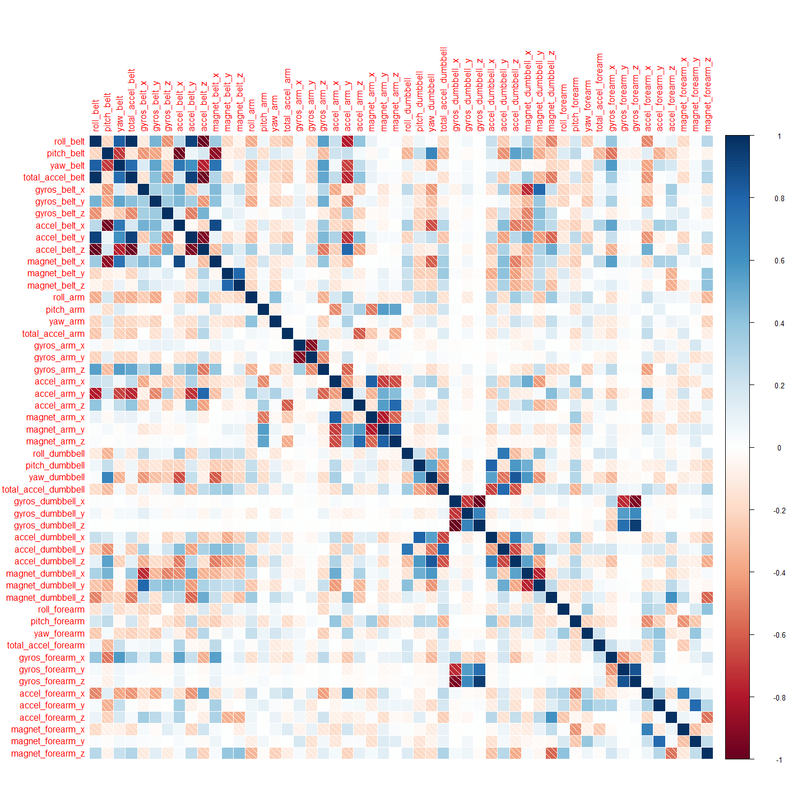
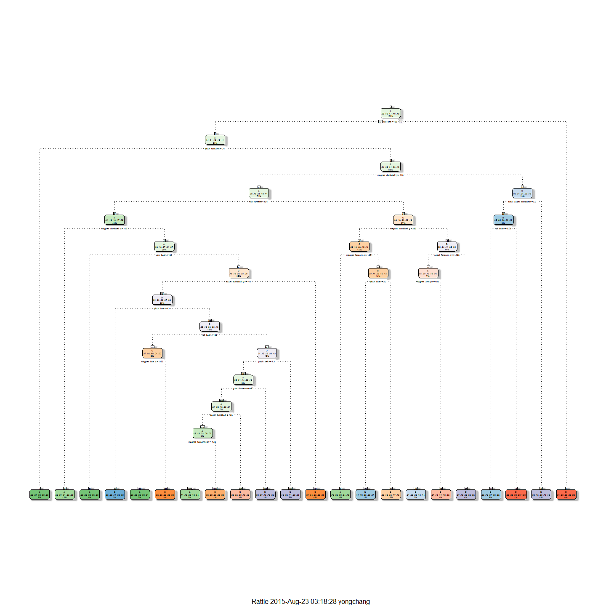

# Machine Learning Course Project
#Background

Using devices such as Jawbone Up, Nike FuelBand, and Fitbit it is now possible to collect a large amount of data about personal activity relatively inexpensively. These type of devices are part of the quantified self movement - a group of enthusiasts who take measurements about themselves regularly to improve their health, to find patterns in their behavior, or because they are tech geeks. One thing that people regularly do is quantify how much of a particular activity they do, but they rarely quantify how well they do it. In this project, your goal will be to use data from accelerometers on the belt, forearm, arm, and dumbell of 6 participants. They were asked to perform barbell lifts correctly and incorrectly in 5 different ways. More information is available from the website here: http://groupware.les.inf.puc-rio.br/har (see the section on the Weight Lifting Exercise Dataset). 

From the site we note the variable classe refers to the following:

* Class A - Perform exactly according to the specification
* Class B - Throwing the elbows to the front 
* Class C - lifting the dumbbell only halfway 
* Class D - lowering the dumbbell only halfway
* Class E - and throwing the hips to the front

# Approach 
* Identify relevant variables to be used to be used in the model
* Split training dataset into a training and validation dataset
* Use Random Forrest to develop a machine learning model on the validation data set
* Apply the final model to the test dataset to ascertain out of sample error
* Use the final model to predict the test dataset

# Identifying Relevant Variables
We first download both the training and test dataset from the links using the code below.

```r
#Downloading Dataset
trainurl <- "https://d396qusza40orc.cloudfront.net/predmachlearn/pml-training.csv"
testurl <- "https://d396qusza40orc.cloudfront.net/predmachlearn/pml-testing.csv"
#Download Training Set
download.file(trainurl, "training.csv")
training <- data.frame(read.csv("training.csv"))
#Download Test Set
download.file(testurl, "test.csv")
test <- data.frame(read.csv("test.csv"))
```
Looking at quick preliminary view of the dataset visually revealed that certain variables were merely summaries of the respondent's measurements and as such had low variation. Other variables like time stamps, X and user names would not be useful in predicting how well they perform a task. The table shows what would be excluded and their reasons. 

Variable      | Reason for Excluding 
------------- | -------------------- 
window        | Low variation        
timestamp     | Time stamp data      
user_name     | Low variation     
X             | Serial number
kurtosis      | Measurement summary
skewness      | Measurement summary
avg           | Measurement summary
min           | Measurement summary
max           | Measurement summary
var           | Measurement summary
amplitude     | Measurement summary

```r
#Removes obviously redundant variables
exvar <- grep("window|timestamp|stddev|kurtosis|skewness|avg_|user_name|min_|max_|var_|amplitude_", names(training))
training.m <- training[-exvar]
#Removes variable X
training.m <- training.m[,-1]
```
We check the remaining dataset to look for any variables with near zero variance to exclude and note that none of the remain variables have zero variance. As such we proceed to split the dataset into a training and validation set.

```r
#Further identifies and further Near Zero Variance 
library(caret)
```

```
## Loading required package: lattice
## Loading required package: ggplot2
```

```r
nearZeroVar(training.m, saveMetrics=TRUE)
```

```
##                      freqRatio percentUnique zeroVar   nzv
## roll_belt             1.101904     6.7781062   FALSE FALSE
## pitch_belt            1.036082     9.3772296   FALSE FALSE
## yaw_belt              1.058480     9.9734991   FALSE FALSE
## total_accel_belt      1.063160     0.1477933   FALSE FALSE
## gyros_belt_x          1.058651     0.7134849   FALSE FALSE
## gyros_belt_y          1.144000     0.3516461   FALSE FALSE
## gyros_belt_z          1.066214     0.8612782   FALSE FALSE
## accel_belt_x          1.055412     0.8357966   FALSE FALSE
## accel_belt_y          1.113725     0.7287738   FALSE FALSE
## accel_belt_z          1.078767     1.5237998   FALSE FALSE
## magnet_belt_x         1.090141     1.6664968   FALSE FALSE
## magnet_belt_y         1.099688     1.5187035   FALSE FALSE
## magnet_belt_z         1.006369     2.3290184   FALSE FALSE
## roll_arm             52.338462    13.5256345   FALSE FALSE
## pitch_arm            87.256410    15.7323412   FALSE FALSE
## yaw_arm              33.029126    14.6570176   FALSE FALSE
## total_accel_arm       1.024526     0.3363572   FALSE FALSE
## gyros_arm_x           1.015504     3.2769341   FALSE FALSE
## gyros_arm_y           1.454369     1.9162165   FALSE FALSE
## gyros_arm_z           1.110687     1.2638875   FALSE FALSE
## accel_arm_x           1.017341     3.9598410   FALSE FALSE
## accel_arm_y           1.140187     2.7367241   FALSE FALSE
## accel_arm_z           1.128000     4.0362858   FALSE FALSE
## magnet_arm_x          1.000000     6.8239731   FALSE FALSE
## magnet_arm_y          1.056818     4.4439914   FALSE FALSE
## magnet_arm_z          1.036364     6.4468454   FALSE FALSE
## roll_dumbbell         1.022388    84.2065029   FALSE FALSE
## pitch_dumbbell        2.277372    81.7449801   FALSE FALSE
## yaw_dumbbell          1.132231    83.4828254   FALSE FALSE
## total_accel_dumbbell  1.072634     0.2191418   FALSE FALSE
## gyros_dumbbell_x      1.003268     1.2282132   FALSE FALSE
## gyros_dumbbell_y      1.264957     1.4167771   FALSE FALSE
## gyros_dumbbell_z      1.060100     1.0498420   FALSE FALSE
## accel_dumbbell_x      1.018018     2.1659362   FALSE FALSE
## accel_dumbbell_y      1.053061     2.3748853   FALSE FALSE
## accel_dumbbell_z      1.133333     2.0894914   FALSE FALSE
## magnet_dumbbell_x     1.098266     5.7486495   FALSE FALSE
## magnet_dumbbell_y     1.197740     4.3012945   FALSE FALSE
## magnet_dumbbell_z     1.020833     3.4451126   FALSE FALSE
## roll_forearm         11.589286    11.0895933   FALSE FALSE
## pitch_forearm        65.983051    14.8557741   FALSE FALSE
## yaw_forearm          15.322835    10.1467740   FALSE FALSE
## total_accel_forearm   1.128928     0.3567424   FALSE FALSE
## gyros_forearm_x       1.059273     1.5187035   FALSE FALSE
## gyros_forearm_y       1.036554     3.7763735   FALSE FALSE
## gyros_forearm_z       1.122917     1.5645704   FALSE FALSE
## accel_forearm_x       1.126437     4.0464784   FALSE FALSE
## accel_forearm_y       1.059406     5.1116094   FALSE FALSE
## accel_forearm_z       1.006250     2.9558659   FALSE FALSE
## magnet_forearm_x      1.012346     7.7667924   FALSE FALSE
## magnet_forearm_y      1.246914     9.5403119   FALSE FALSE
## magnet_forearm_z      1.000000     8.5771073   FALSE FALSE
## classe                1.469581     0.0254816   FALSE FALSE
```
#Split Dataset into Training & Validation Sets
Given the dataset consist of 15,699 cases, we decide will use 80% of the dataset to train the model and another 20% for validation. Based on this 11,776 cases are in the training set and 3,923 in the vaidation set.

```r
library(caret)
##Create data partitions
set.seed(12345)
part <- createDataPartition(training.m$classe, p=0.8, list=FALSE)
trainset <- training.m[part,]
validset <- training.m[-part,]
dim(trainset) ; dim(validset)
```

```
## [1] 15699    53
```

```
## [1] 3923   53
```
We conduct a simple exploratory analysis using correlation plots to check for potential issues with collinearity. From the chart below, the closer the colors are to blue, the higher the correlation between the variables. Certain variables appear to be highly correlated with each other suggesting potential problems with using a linear model. As such tree models would be used.

```r
library(corrplot)
m <- cor(trainset[,-53])
corrplot(m, method="shade")
```

 

# Use Random Forrest to develop a machine learning model on the validation data set
## Generating 1 Tree
We generate a decision tree to get a sense of how the model would potentially look like.

```r
library(rattle)
```

```
## Loading required package: RGtk2
## Rattle: A free graphical interface for data mining with R.
## Version 3.5.0 Copyright (c) 2006-2015 Togaware Pty Ltd.
## Type 'rattle()' to shake, rattle, and roll your data.
```

```r
library(rpart)
tree1 <- rpart(classe~., method="class", data=trainset, model=TRUE)
fancyRpartPlot(tree1)
```

 
## Modeling using Random Forrest
We will use the Random Forrest to create the model since it is robust for non-linear models. This is important given the potential collinear issues that might be faced with. We used both the randomForest package as well as the Caret package with CV settings in an attempt to determine the best model for accuracy. 


```r
#Optimise data by using dual core
library(doParallel)
```

```
## Loading required package: foreach
## Loading required package: iterators
## Loading required package: parallel
```

```r
registerDoParallel(cores=2)
##Using Caret Package we set ntree to 275 for random forrest as function did not seem to work with any number beyond. We use Cross validation with 5 folds. 
com <- trainControl(method="cv", number=5)
set.seed(123456)
modfitCaret <- train(classe~., method="rf", trControl=com, data=trainset, ntree=275)
```

```
## Loading required package: randomForest
## randomForest 4.6-10
## Type rfNews() to see new features/changes/bug fixes.
```

```r
modfitCaret
```

```
## Random Forest 
## 
## 15699 samples
##    52 predictor
##     5 classes: 'A', 'B', 'C', 'D', 'E' 
## 
## No pre-processing
## Resampling: Cross-Validated (5 fold) 
## Summary of sample sizes: 12559, 12559, 12561, 12559, 12558 
## Resampling results across tuning parameters:
## 
##   mtry  Accuracy   Kappa      Accuracy SD  Kappa SD   
##    2    0.9926742  0.9907323  0.003056464  0.003867344
##   27    0.9920370  0.9899270  0.002852086  0.003607719
##   52    0.9881512  0.9850097  0.003991668  0.005052177
## 
## Accuracy was used to select the optimal model using  the largest value.
## The final value used for the model was mtry = 2.
```

```r
##Random Forrest from randomForest package
library(randomForest)
set.seed(123456)
modfitRF <- randomForest(classe~., data=trainset, ntree=500)
modfitRF
```

```
## 
## Call:
##  randomForest(formula = classe ~ ., data = trainset, ntree = 500) 
##                Type of random forest: classification
##                      Number of trees: 500
## No. of variables tried at each split: 7
## 
##         OOB estimate of  error rate: 0.38%
## Confusion matrix:
##      A    B    C    D    E  class.error
## A 4462    1    1    0    0 0.0004480287
## B   12 3022    4    0    0 0.0052666228
## C    0    8 2727    3    0 0.0040175310
## D    0    0   21 2550    2 0.0089389817
## E    0    0    2    6 2878 0.0027720028
```
From the output the out of bag error rates for the Caret package model was 0.73% (Using 1-0.9926742 from mtry=2 accuracy) while that of the randomForrest package model was 0.38%. It would appear using modfitRF(randomForrest package model) would yield better results.

# Apply the final model to the test dataset to ascertain out of sample error
Given the closeness of the two models we test both on the validation dataset. The accuracy rating of modfitRF was better at 99.46% (out of sample error of 0.54%) compared to 99.18% (out of sample error of 0.82%) from the modfitCaret model. We would thus use the modfitRF on the final test data.

```r
##Testing Caret package model on validation set
confusionMatrix(validset$classe, predict(modfitCaret, validset))
```

```
## Confusion Matrix and Statistics
## 
##           Reference
## Prediction    A    B    C    D    E
##          A 1116    0    0    0    0
##          B    6  751    2    0    0
##          C    0    9  675    0    0
##          D    0    0   13  630    0
##          E    0    0    0    2  719
## 
## Overall Statistics
##                                           
##                Accuracy : 0.9918          
##                  95% CI : (0.9885, 0.9944)
##     No Information Rate : 0.286           
##     P-Value [Acc > NIR] : < 2.2e-16       
##                                           
##                   Kappa : 0.9897          
##  Mcnemar's Test P-Value : NA              
## 
## Statistics by Class:
## 
##                      Class: A Class: B Class: C Class: D Class: E
## Sensitivity            0.9947   0.9882   0.9783   0.9968   1.0000
## Specificity            1.0000   0.9975   0.9972   0.9960   0.9994
## Pos Pred Value         1.0000   0.9895   0.9868   0.9798   0.9972
## Neg Pred Value         0.9979   0.9972   0.9954   0.9994   1.0000
## Prevalence             0.2860   0.1937   0.1759   0.1611   0.1833
## Detection Rate         0.2845   0.1914   0.1721   0.1606   0.1833
## Detection Prevalence   0.2845   0.1935   0.1744   0.1639   0.1838
## Balanced Accuracy      0.9973   0.9928   0.9877   0.9964   0.9997
```

```r
##Testing randomForrest package model on validation set
confusionMatrix(validset$classe, predict(modfitRF, validset))
```

```
## Confusion Matrix and Statistics
## 
##           Reference
## Prediction    A    B    C    D    E
##          A 1116    0    0    0    0
##          B    2  757    0    0    0
##          C    0    8  676    0    0
##          D    0    0   10  633    0
##          E    0    0    0    1  720
## 
## Overall Statistics
##                                           
##                Accuracy : 0.9946          
##                  95% CI : (0.9918, 0.9967)
##     No Information Rate : 0.285           
##     P-Value [Acc > NIR] : < 2.2e-16       
##                                           
##                   Kappa : 0.9932          
##  Mcnemar's Test P-Value : NA              
## 
## Statistics by Class:
## 
##                      Class: A Class: B Class: C Class: D Class: E
## Sensitivity            0.9982   0.9895   0.9854   0.9984   1.0000
## Specificity            1.0000   0.9994   0.9975   0.9970   0.9997
## Pos Pred Value         1.0000   0.9974   0.9883   0.9844   0.9986
## Neg Pred Value         0.9993   0.9975   0.9969   0.9997   1.0000
## Prevalence             0.2850   0.1950   0.1749   0.1616   0.1835
## Detection Rate         0.2845   0.1930   0.1723   0.1614   0.1835
## Detection Prevalence   0.2845   0.1935   0.1744   0.1639   0.1838
## Balanced Accuracy      0.9991   0.9945   0.9915   0.9977   0.9998
```

# Use the final model to predict the test dataset
We now use the selected model of modfitRF to predict the testset. And get the following predictions. This would be submitted.

```r
#Removing excluded variables
test.m <- test[-exvar]
testset <- test.m[,-1]
#Predicting the testset
predict(modfitRF, testset)
```

```
##  1  2  3  4  5  6  7  8  9 10 11 12 13 14 15 16 17 18 19 20 
##  B  A  B  A  A  E  D  B  A  A  B  C  B  A  E  E  A  B  B  B 
## Levels: A B C D E
```


